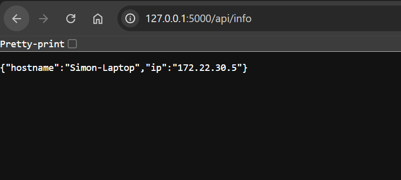
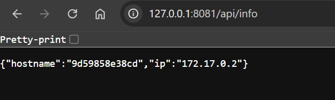

# Flask Tutorial - Demo API

[Back](../../README.md)

- [Flask Tutorial - Demo API](#flask-tutorial---demo-api)
  - [Prerequisite](#prerequisite)
  - [Create Demo App](#create-demo-app)
  - [Dockerize](#dockerize)
  - [Upload DockerHub](#upload-dockerhub)

---

## Prerequisite

- Create ENV
- Install Flask

---

## Create Demo App

- `demoAPI/app.py`

```py
import socket
from flask import Flask

app = Flask(__name__)


@app.route('/api/info', methods=['GET'])
def get_info():
    info = dict()

    hostname = socket.gethostname()
    ip = socket.gethostbyname(hostname)

    info['ip'] = ip
    info['hostname'] = hostname

    return info, 201
```

- Run

```sh
flask --app hello run
```

- Test http://127.0.0.1:5000/api/info



---

## Dockerize

```sh
# build
docker build -t img_demoapi .

# create container
docker run -d --name con_demoapi -p 8081:8080 img_demoapi
```

- Test http://127.0.0.1:8081/api/info



---

## Upload DockerHub

```sh
docker images
# REPOSITORY                                            TAG         IMAGE ID       CREATED          SIZE
# img_demoapi                                           latest      f45eeb63f602   14 minutes ago   117MB

# retag image
docker tag f45eeb63f602 simonangelfong/flask-demo:v1.0

# confirm
docker images
# REPOSITORY                                            TAG         IMAGE ID       CREATED          SIZE
# simonangelfong/flask-demo                             v1.0        f45eeb63f602   18 minutes ago   117MB

# upload 
docker push simonangelfong/flask-demo:v1.0
```