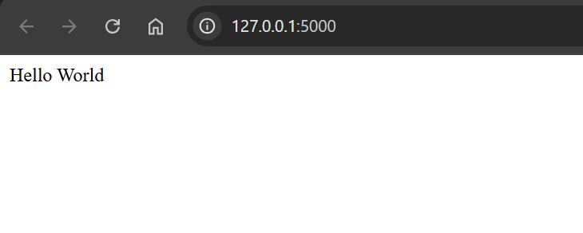

# Flask Tutorial - 01 Hello World

[Back](../../README.md)

- [Flask Tutorial - 01 Hello World](#flask-tutorial---01-hello-world)
  - [Create Virtual Environment](#create-virtual-environment)
  - [Create hello world](#create-hello-world)

---

## Create Virtual Environment

```sh
mkdir 01hello_world
cd 01hello_world

python -m venv env

env/Scripts/activate

pip install Flask
```

---

## Create hello world

- `01hello_world/hello.py`

```py
from flask import Flask
app = Flask(__name__)

@app.route('/')
def hello_world():
   return 'Hello World'

if __name__ == '__main__':
   app.run()
```

- Run

```sh
python hello.py
```


